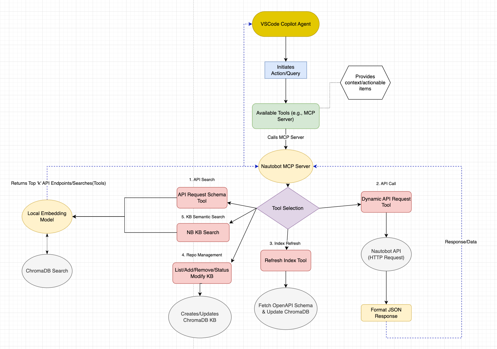

# Nautobot MCP Server

A Model Context Protocol (MCP) server for interacting with Nautobot APIs using semantic search and dynamic API requests. This server provides intelligent access to Nautobot instances and a comprehensive knowledge base of Nautobot-related repositories.

## 🚀 Features

### Core Capabilities
- **Dynamic API Access**: Perform CRUD operations on any Nautobot API endpoint
- **Semantic Endpoint Discovery**: Find relevant API endpoints using natural language queries
- **Knowledge Base Search**: Access indexed content from official Nautobot repositories
- **Multi-Environment Support**: Connect to different Nautobot instances (dev, staging, prod)
- **Smart Caching**: Efficient ChromaDB-powered vector storage with Git-based updates

### API Tools
- `nautobot_dynamic_api_request`: Execute any HTTP method against Nautobot APIs
- `nautobot_openapi_api_request_schema`: Discover API endpoints through semantic search
- `nautobot_kb_semantic_search`: Search through indexed Nautobot documentation and code
- Repository management tools for maintaining the knowledge base

## 📋 Prerequisites

- Python 3.11+ (< 3.12)
- Access to a Nautobot instance
- Git (for repository cloning and updates)
- GitHub token (for accessing repositories)


## Design Overview



## 🛠️ Installation

1. **Clone the repository**:
   ```bash
   git clone <repository-url>
   cd nautobot_mcp
   ```

2. **Install dependencies**:
   ```bash
   # Using uv (recommended)
   uv sync

   # Or using pip
   pip install -e .
   ```

3. **Configure environment variables**:
   ```bash
   cp .env.example .env
   # Edit .env with your configuration
   ```

## ⚙️ Configuration

### Environment Variables

Create a `.env` file with the following variables:

```bash
# Nautobot API Configuration
NAUTOBOT_TOKEN=your_nautobot_api_token
NAUTOBOT_ENV=local  # Options: local, nonprod, prod

# Environment-specific URLs and tokens
NAUTOBOT_NONPROD_BASE_URL=https://nautobot-nonprod.example.com/
NAUTOBOT_NONPROD_TOKEN=your_nonprod_token
NAUTOBOT_PROD_BASE_URL=https://nautobot.example.com/
NAUTOBOT_PROD_TOKEN=your_prod_token

# GitHub Configuration (for knowledge base)
GITHUB_TOKEN=your_github_token

# Optional Configuration
SSL_VERIFY=False  # Set to True for production
POSTHOG_API_KEY=disable  # Analytics (optional)
```

### Repository Configuration

The knowledge base automatically indexes official Nautobot repositories. You can customize this by editing:
- `config/repositories.json` - Official and community repositories
- `config/user_repositories.json` - Your custom repositories

Example repository configuration:
```json
{
  "name": "nautobot/nautobot",
  "description": "Core Nautobot application",
  "priority": 1,
  "enabled": true,
  "branch": "develop",
  "file_patterns": [".py", ".md", ".txt", ".rst", ".yaml", ".yml"]
}
```

### Configuration Options Reference

| Environment Variable | Default | Description |
|---------------------|---------|-------------|
| `NAUTOBOT_TOKEN` | `` | API token for authentication |
| `NAUTOBOT_ENV` | `local` | Environment selection (local/nonprod/prod) |
| `GITHUB_TOKEN` | `""` | GitHub token for repository access |
| `API_PREFIX` | `nautobot_openapi` | MCP tool prefix |
| `SERVER_NAME` | `any_openapi` | MCP server name |
| `SERVER_VERSION` | `0.2.0` | Server version |
| `LOG_LEVEL` | `INFO` | Logging level |
| `EMBEDDING_MODEL` | `all-MiniLM-L6-v2` | Sentence transformer model |
| `DEFAULT_SEARCH_RESULTS` | `5` | Default number of search results |
| `POSTHOG_API_KEY` | `disable` | PostHog analytics API key |
| `API_TIMEOUT` | `10` | Request timeout in seconds |
| `SSL_VERIFY` | `True` | SSL certificate verification |


## 🚀 Usage

### Starting the MCP Server

```bash
python server.py
```

The server will automatically:
1. Initialize the ChromaDB collections
2. Refresh the API endpoint index
3. Update the knowledge base from configured repositories
4. Start serving MCP requests

### Integration with VS Code Copilot

Add to your VS Code settings to use with GitHub Copilot:

```json
{
  "github.copilot.chat.tools": [
    {
      "name": "nautobot_mcp",
      "command": "python",
      "args": ["/path/to/nautobot_mcp/server.py"],
      "env": {
        "PYTHONPATH": "/path/to/nautobot_mcp"
      }
    }
  ]
}
```

### Example API Requests

#### Search for API Endpoints
```python
# Find endpoints related to devices
query = "get device information"
# Returns relevant endpoints like /dcim/devices/
```

#### Execute API Requests
```python
# Get all locations
method = "GET"
path = "/dcim/locations/"
params = {"limit": 100}
```

#### Search Knowledge Base
```python
# Find documentation about custom fields
query = "how to create custom fields in Nautobot"
# Returns relevant documentation and code examples
```

## 📁 Project Structure

```
nautobot_mcp/
├── server.py                 # Main MCP server
├── pyproject.toml            # Project configuration
├── .env                      # Environment variables
│
├── config/                   # Configuration files
│   ├── repositories.json     # Official repository definitions
│   └── user_repositories.json # User-defined repositories
│
├── helpers/                  # Core modules
│   ├── nb_kb_v2.py          # Enhanced knowledge base
│   ├── endpoint_searcher_chroma.py # API endpoint search
│   ├── content_processor.py  # Document processing
│   └── manage_repos.py       # Repository management
│
├── utils/                    # Utility modules
│   ├── config.py            # Configuration management
│   ├── embedding.py         # Vector embedding utilities
│   ├── git_manager.py       # Git operations
│   └── repo_config.py       # Repository configuration
│
├── examples/                 # Usage examples
│   ├── example_kb_search.py  # Knowledge base search demo
│   ├── config_demo.py       # Configuration examples
│   └── pynautobot_kb_example/ # PyNautobot integration
│
├── tests/                    # Test suite
│   ├── test_nb_kb_v2.py     # Knowledge base tests
│   ├── test_endpoint_searcher_chroma.py # API search tests
│   └── test_manage_repos.py  # Repository management tests
│
└── backend/                  # Data storage
    └── models/               # Cached embedding models
```

## 🔧 Development

### Running Tests

```bash
# Run all tests
pytest

# Run specific test categories
pytest -m "unit"
pytest -m "integration"
pytest -m "not slow"

# Run with coverage
pytest --cov=helpers --cov=utils
```

### Code Quality

The project uses several tools for code quality:

```bash
# Format code
ruff format .

# Lint code
ruff check .

# Pre-commit hooks (install once)
pre-commit install
```

### Adding New Repositories

To add repositories to the knowledge base:

1. **Add to configuration**:
   ```python
   from helpers.manage_repos import RepositoryManager
   
   manager = RepositoryManager()
   manager.add_repository("owner/repo", category="custom", description="My custom repo")
   ```

2. **Initialize the repository**:
   ```python
   manager.initialize_repositories(force=True)
   ```

## 📖 Examples

### Basic Knowledge Base Search

```python
from helpers.nb_kb_v2 import EnhancedNautobotKnowledge

kb = EnhancedNautobotKnowledge()
results = kb.search("custom field validation", n_results=5)

for result in results:
    print(f"Repository: {result['metadata']['repository']}")
    print(f"File: {result['metadata']['file_path']}")
    print(f"Content: {result['document'][:200]}...")
```

### API Endpoint Discovery

```python
from helpers.endpoint_searcher_chroma import EndpointSearcherChroma

searcher = EndpointSearcherChroma()
endpoints = searcher.search("create new device", n_results=3)

for endpoint in endpoints:
    print(f"Method: {endpoint['method']}")
    print(f"Path: {endpoint['path']}")
    print(f"Description: {endpoint['description']}")
```

### Dynamic API Requests

```python
import requests
from utils.config import config

# Example: Get device count
response = requests.get(
    f"{config.NAUTOBOT_BASE_URL}/api/dcim/devices/",
    headers={"Authorization": f"Token {config.NAUTOBOT_TOKEN}"},
    params={"limit": 1},
    verify=config.SSL_VERIFY
)

total_count = response.json()["count"]
print(f"Total devices: {total_count}")
```


## 🤝 Contributing

1. Fork the repository
2. Create a feature branch (`git checkout -b feature/amazing-feature`)
3. Commit your changes (`git commit -m 'Add amazing feature'`)
4. Push to the branch (`git push origin feature/amazing-feature`)
5. Open a Pull Request

### Development Guidelines

- Follow PEP 8 style guidelines
- Add tests for new functionality
- Update documentation for API changes
- Use type hints where appropriate
- Run the full test suite before submitting

## 🧪 Testing & Validation

### Available Examples

The `examples/` directory contains several demonstration scripts:

- **`example_kb_search.py`** - Basic knowledge base search functionality
- **`example_job.py`** - Example Nautobot job integration
- **`demo_hybrid_processing.py`** - Demonstrates hybrid content processing
- **`example_detailed_search_analysis.py`** - Advanced search analysis
- **`fetch_schema.py`** - OpenAPI schema fetching utility
- **`pynautobot_kb_example/`** - PyNautobot integration examples

### Running Tests

The project includes comprehensive tests in the `tests/` directory:

```bash
# Run all tests
uv run python -m pytest tests/

# Run specific test files
uv run python tests/test_nb_kb_v2.py
uv run python tests/test_endpoint_searcher_chroma.py
uv run python tests/test_manage_repos.py
```

### Validation

Test your configuration and server setup:

```bash
# Test configuration
uv run python -c "from utils.config import config; print('Config OK:', config.SERVER_NAME)"

# Test server initialization
uv run python -c "from server import main; print('Server imports OK')"
```

## 🛠️ MCP Tools Available

### API Tools
- **`nautobot_openapi_api_request_schema`**: Search for API endpoints by intent
- **`nautobot_dynamic_api_request`**: Execute API requests with any HTTP method
- **`refresh_endpoint_index`**: Manually refresh the endpoint search index

### Knowledge Base Tools
- **`nautobot_kb_semantic_search`**: Semantic search over Nautobot knowledge base repositories
- **`nautobot_kb_list_repos`**: List repositories configured in Nautobot knowledge base
- **`nautobot_kb_add_repo`**: Add a new repository to the Nautobot knowledge base
- **`nautobot_kb_remove_repo`**: Remove an existing repository from the Nautobot knowledge base
- **`nautobot_kb_update_repos`**: Update repositories in the Nautobot knowledge base
- **`nautobot_kb_init_repos`**: Initialize repositories in the Nautobot knowledge base
- **`nautobot_kb_repo_status`**: Show nautobot knowledge base repository status including document counts and indexing status

## 🐛 Troubleshooting

### Common Issues

1. **SSL Certificate Errors**:
   ```bash
   # Set SSL_VERIFY=False in .env for development
   SSL_VERIFY=False
   ```

2. **ChromaDB Permission Issues**:
   ```bash
   # Ensure proper permissions on the backend directory
   chmod -R 755 backend/
   ```

3. **GitHub API Rate Limits**:
   ```bash
   # Ensure you have a valid GitHub token
   GITHUB_TOKEN=your_github_token
   ```

4. **Repository Initialization Fails**:
   ```python
   # Force reinitialize repositories
   kb = EnhancedNautobotKnowledge()
   kb.initialize_all_repositories(force=True)
   ```

### Debug Mode

Enable debug logging by setting:
```bash
LOG_LEVEL=DEBUG
```

## 📞 Support

- Create an issue for bug reports or feature requests
- Check the `examples/` directory for usage patterns
- Review the test suite for implementation details

## 🙏 Acknowledgments

- [Nautobot](https://github.com/nautobot/nautobot) - Network automation platform
- [Model Context Protocol](https://github.com/modelcontextprotocol/python-sdk) - MCP Python SDK
- [ChromaDB](https://github.com/chroma-core/chroma) - Vector database
- [Sentence Transformers](https://github.com/UKPLab/sentence-transformers) - Embedding models

## 📝 License

This project is licensed under the MIT License - see the [LICENSE](LICENSE) file for details.