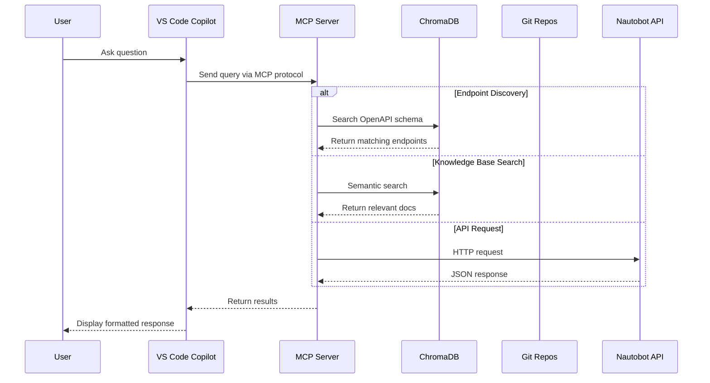
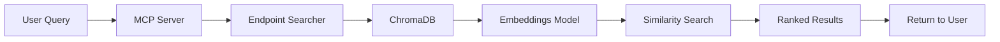
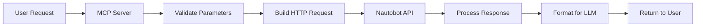
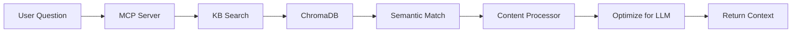
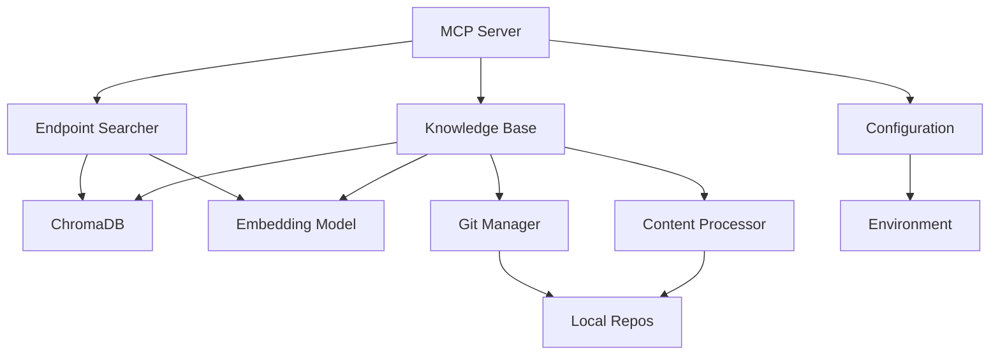

# Architecture Overview

This document provides a comprehensive overview of the Nautobot MCP Server architecture, explaining how components work together to provide intelligent API access and knowledge base search.

## System Architecture


The architecture consists of several key layers:

1. **Client Layer** - VS Code with GitHub Copilot
2. **Protocol Layer** - Model Context Protocol (MCP)
3. **Server Layer** - Nautobot MCP Server
4. **Storage Layer** - ChromaDB and Git repositories
5. **External Services** - Nautobot API and GitHub

## High-Level Data Flow



## Core Components

### 1. MCP Server (`server.py`)

The main server implements the Model Context Protocol specification and orchestrates all operations.

**Key Responsibilities:**

- Handle MCP protocol messages (tools, prompts, resources)
- Route requests to appropriate handlers
- Manage server lifecycle and initialization
- Coordinate between different subsystems

**Tool Handlers:**

```python
@server.call_tool()
async def handle_invoke_tool(name: str, inputs: Dict[str, Any]):
    if name == "nautobot_dynamic_api_request":
        # Execute API request
    elif name == "nautobot_openapi_api_request_schema":
        # Search endpoints
    elif name == "nautobot_kb_semantic_search":
        # Search knowledge base
    # ... more tools
```

### 2. Endpoint Searcher (`helpers/endpoint_searcher_chroma.py`)

Manages the OpenAPI schema index for semantic endpoint discovery.

**Features:**

- Fetches OpenAPI schema from Nautobot
- Indexes endpoints with descriptions and parameters
- Provides semantic search over API endpoints
- Caches embeddings for fast retrieval

**Process:**

1. Fetch OpenAPI spec from `/api/docs/?format=openapi`
2. Extract all endpoints with methods, paths, descriptions
3. Generate embeddings using sentence-transformers
4. Store in ChromaDB collection `openapi_endpoints`
5. Enable semantic search: "create device" → `/api/dcim/devices/` POST

### 3. Knowledge Base (`helpers/nb_kb_v2.py`)

Enhanced knowledge base system for indexing and searching Nautobot documentation and code.

**Components:**

- **Repository Manager**: Clones and updates Git repositories
- **Content Processor**: Extracts and processes different file types
- **Embedding Generator**: Creates vector embeddings
- **Search Engine**: Semantic search with result optimization

**Indexed Content:**

- Python source code (`.py`)
- Markdown documentation (`.md`)
- reStructuredText (`.rst`)
- YAML/JSON configuration files
- Text files with relevant content

**Search Optimization:**

```python
# Two search methods available:
results = kb.search(query, n_results=5)  # Basic search
results = kb.search_optimized_for_llm(
    query, 
    n_results=5,
    max_content_length=500
)  # Optimized with content extraction
```

### 4. ChromaDB Vector Store

Persistent vector database for efficient similarity search.

**Collections:**

| Collection | Purpose | Contents |
|------------|---------|----------|
| `openapi_endpoints` | API endpoint search | Method, path, description, parameters |
| `nb_kb_collection` | Knowledge base | Documentation, code, examples |

**Storage Location:**

```
backend/nautobot_mcp/
├── chroma.sqlite3          # Metadata database
└── [vector files]          # Embedding vectors
```

**Benefits:**

- Fast similarity search (< 100ms)
- Persistent storage across restarts
- Efficient memory usage
- Built-in relevance scoring

### 5. Embedding Model

Uses Sentence Transformers for generating text embeddings.

**Default Model:** `all-MiniLM-L6-v2`

- **Size:** ~90MB
- **Speed:** Fast inference
- **Quality:** Good for semantic search
- **Dimensions:** 384

**Model Selection:**

Configurable via environment variable:

```bash
EMBEDDING_MODEL=all-MiniLM-L6-v2  # Default
# EMBEDDING_MODEL=all-mpnet-base-v2  # Higher quality, slower
```

### 6. Repository Management

Handles Git repository operations for the knowledge base.

**Configuration Files:**

- `config/repositories.json` - Official repositories
- `config/user_repositories.json` - User-added repositories

**Repository Structure:**

```json
{
  "name": "nautobot/nautobot",
  "description": "Core Nautobot application",
  "priority": 1,
  "enabled": true,
  "branch": "develop",
  "file_patterns": [".py", ".md", ".rst"]
}
```

**Update Strategy:**

1. Check if repository exists locally
2. If not, clone from GitHub
3. If exists, run `git pull` to update
4. Re-index only changed files
5. Update ChromaDB with new content

## Request Flow Patterns

### Pattern 1: Endpoint Discovery



**Example:**

User asks: "How do I create a device?"

1. Query → MCP Server
2. Server → `nautobot_openapi_api_request_schema` tool
3. Tool → ChromaDB semantic search
4. ChromaDB → Find similar endpoints
5. Return ranked list of endpoints with descriptions

### Pattern 2: API Execution



**Example:**

User asks: "Get all active devices"

1. Request → MCP Server
2. Server → `nautobot_dynamic_api_request` tool
3. Build request: GET `/api/dcim/devices/?status=active`
4. Execute with authentication header
5. Parse JSON response
6. Format for readability
7. Return to Copilot

### Pattern 3: Knowledge Base Search



**Example:**

User asks: "How do custom fields work in Nautobot?"

1. Question → MCP Server
2. Server → `nautobot_kb_semantic_search` tool
3. Search across all indexed repos
4. Find relevant documentation sections
5. Extract key information
6. Optimize content length
7. Return with source references

## Performance Optimizations

### 1. Caching Strategy

**Vector Cache:**
- Embeddings stored in ChromaDB
- No re-computation on queries
- Fast retrieval (< 100ms)

**Model Cache:**
- Sentence transformer loaded once
- Kept in memory for subsequent requests
- Download cached locally after first use

**Git Repository Cache:**
- Local clones updated with `git pull`
- Only changed files re-indexed
- Hash-based change detection

### 2. Lazy Loading

Components initialize on-demand:

```python
# Endpoint searcher initializes when first needed
if not hasattr(self, '_endpoint_searcher'):
    self._endpoint_searcher = EndpointSearcherChroma()

# Knowledge base initializes on first search
if not hasattr(self, '_kb'):
    self._kb = EnhancedNautobotKnowledge()
```

### 3. Content Processing

**Hybrid Processing:**

Different strategies for different file types:

- **Code files**: Extract docstrings, function signatures
- **Markdown**: Extract headings, code blocks
- **Large files**: Chunk with overlap for context

**LLM Optimization:**

```python
# Extract only query-relevant content
content = processor.extract_query_relevant_content(
    document=doc,
    query=query,
    max_length=500
)
```

## Security Considerations

### 1. API Token Management

- Tokens stored in `.env` file (not committed)
- Passed via HTTP headers, never in URLs
- Support for multiple environments

### 2. SSL/TLS

Configurable SSL verification:

```python
SSL_VERIFY=True  # Production (default)
SSL_VERIFY=False # Development with self-signed certs
```

### 3. Repository Access

- Public repositories: No token required
- Private repositories: Requires GitHub token
- Token permissions: Read-only sufficient

### 4. Data Privacy

- All data stored locally
- No external services (except Nautobot and GitHub)
- No telemetry by default (`POSTHOG_API_KEY=disable`)

## Scalability

### Current Limitations

- **Single server instance**: No horizontal scaling
- **Local storage**: Limited by disk space
- **Memory usage**: ~500MB-1GB with all repos indexed

### Future Enhancements

Potential improvements for larger deployments:

1. **Distributed ChromaDB**: Scale vector storage
2. **Redis caching**: Share cache across instances
3. **Async processing**: Parallel repository updates
4. **Database backend**: PostgreSQL for metadata

## Configuration Management

### Environment-Based Configuration

```python
# utils/config.py
class Config:
    def __init__(self):
        load_dotenv()
        self.NAUTOBOT_ENV = os.getenv("NAUTOBOT_ENV", "local")
        self.NAUTOBOT_URL = self._get_env_url()
        # ... more config
    
    def _get_env_url(self):
        env_map = {
            "local": os.getenv("NAUTOBOT_URL_LOCAL"),
            "nonprod": os.getenv("NAUTOBOT_URL_NONPROD"),
            "prod": os.getenv("NAUTOBOT_URL_PROD"),
        }
        return env_map.get(self.NAUTOBOT_ENV)
```

### Repository Configuration

Two-tiered system:

1. **Official repositories** (`config/repositories.json`)
   - Maintained by project
   - Version controlled
   - Updates via git pull

2. **User repositories** (`config/user_repositories.json`)
   - Added dynamically via MCP tools
   - Not version controlled
   - User-managed

## Monitoring and Logging

### Log Levels

Configurable via `LOG_LEVEL` environment variable:

- `DEBUG`: Detailed information for diagnostics
- `INFO`: General informational messages (default)
- `WARNING`: Warning messages for potential issues
- `ERROR`: Error messages for failures

### Log Output

Example log messages:

```
2024-10-14 20:30:01 [INFO] Initializing MCP Server...
2024-10-14 20:30:02 [DEBUG] Loading embedding model: all-MiniLM-L6-v2
2024-10-14 20:30:03 [INFO] ChromaDB collections initialized
2024-10-14 20:30:04 [DEBUG] Fetching OpenAPI schema from http://localhost:8000
2024-10-14 20:30:05 [INFO] Indexed 250 API endpoints
```

## Testing Architecture

### Test Structure

```
tests/
├── test_endpoint_searcher_chroma.py  # API search tests
├── test_nb_kb_v2.py                  # Knowledge base tests
├── test_manage_repos.py              # Repository management tests
└── test_config.py                    # Configuration tests
```

### Test Strategies

**Unit Tests:**
- Individual component testing
- Mocked external dependencies
- Fast execution

**Integration Tests:**
- End-to-end workflows
- Real ChromaDB instances
- Marked with `@pytest.mark.integration`

**Offline Tests:**
- No network required
- Cached data
- Marked with `@pytest.mark.offline`

## Component Dependencies



## Next Steps

- [Tools Reference](tools.md) - Learn about available MCP tools
- [Examples](examples.md) - See practical use cases
- [Development Guide](development.md) - Contributing to the project
