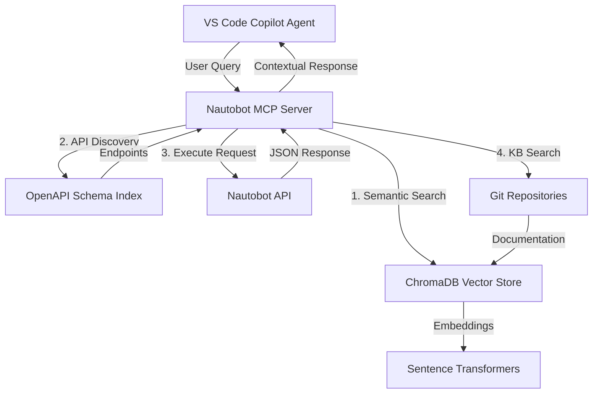

# Nautobot MCP Server


**A Model Context Protocol (MCP) server for intelligent interaction with Nautobot APIs**

[](https://github.com/kvncampos/nautobot_mcp/blob/main/LICENSE)
[](https://www.python.org/downloads/)
[](https://github.com/astral-sh/ruff)

## Overview

The Nautobot MCP Server bridges the gap between AI assistants (like GitHub Copilot) and Nautobot network automation platforms. It provides intelligent access to Nautobot APIs through semantic search, natural language queries, and a comprehensive knowledge base of Nautobot documentation.

## Key Features

### 🔍 **Semantic Search**
Find relevant API endpoints and documentation using natural language queries instead of memorizing exact paths and parameters.

### 🚀 **Dynamic API Access**
Perform CRUD operations on any Nautobot API endpoint with intelligent parameter suggestions and validation.

### 📚 **Knowledge Base**
Access indexed content from official Nautobot repositories including documentation, code examples, and best practices.

### 🔄 **Smart Caching**
Efficient ChromaDB-powered vector storage with Git-based updates ensures fast responses and up-to-date information.

### 🌐 **Multi-Environment Support**
Connect to different Nautobot instances (development, staging, production) with environment-specific configurations.

### 🛠️ **Repository Management**
Dynamically add, remove, and manage repositories in the knowledge base without server restarts.

## Architecture

The Nautobot MCP Server acts as an intermediary between your AI assistant (like GitHub Copilot in VS Code) and your Nautobot instance:



### How It Works

1. **User initiates a query** through VS Code Copilot
2. **MCP Server receives** the request and determines the appropriate tool
3. **Semantic search** finds relevant endpoints or documentation
4. **API call is made** to Nautobot with proper authentication
5. **Response is processed** and returned with context
6. **Copilot formats** the response for the user

## Quick Start

Get started in minutes with our [Quick Start Guide](quickstart.md).

```bash
# Clone and install
git clone https://github.com/kvncampos/nautobot_mcp.git
cd nautobot_mcp
uv sync

# Configure
cp .env.example .env
# Edit .env with your settings

# Run
python server.py
```

## Use Cases

### 🔧 DevOps Engineers
- Quickly find and test API endpoints
- Automate common Nautobot tasks
- Build custom automation workflows

### 📝 Documentation Writers
- Search for code examples and patterns
- Understand API capabilities
- Document integration scenarios

### 🎓 Learning & Training
- Explore Nautobot features interactively
- Get instant answers to "how do I..." questions
- Learn best practices from indexed repositories

### 🏢 Enterprise Teams
- Standardize API access patterns
- Share knowledge across teams
- Maintain consistency across environments

## Available Tools

The server provides several MCP tools:

| Tool | Purpose |
|------|---------|
| `nautobot_dynamic_api_request` | Execute any HTTP method against Nautobot APIs |
| `nautobot_openapi_api_request_schema` | Discover API endpoints through semantic search |
| `nautobot_kb_semantic_search` | Search through indexed Nautobot documentation |
| `nautobot_kb_list_repos` | List available knowledge base repositories |
| `nautobot_kb_add_repo` | Add custom repositories to the knowledge base |
| `nautobot_kb_remove_repo` | Remove repositories from the knowledge base |
| `nautobot_kb_update_repo` | Update existing repositories |
| `nautobot_kb_search_code` | Search for code examples |

Learn more in the [Tools Documentation](tools.md).

## What's Next?

- **[Installation Guide](installation.md)** - Detailed installation instructions
- **[Quick Start](quickstart.md)** - Get up and running in minutes
- **[Configuration](configuration.md)** - Configure for your environment
- **[Architecture](architecture.md)** - Understand the design and components
- **[Examples](examples.md)** - Real-world usage examples

## Community & Support

- 📖 [Documentation](https://kvncampos.github.io/nautobot_mcp/)
- 🐛 [Issue Tracker](https://github.com/kvncampos/nautobot_mcp/issues)
- 💬 [Discussions](https://github.com/kvncampos/nautobot_mcp/discussions)
- 📧 [Contact](mailto:kvncampos@duck.com)

## License

This project is licensed under the MIT License - see the [LICENSE](https://github.com/kvncampos/nautobot_mcp/blob/main/LICENSE) file for details.

## Acknowledgments

- [Nautobot](https://github.com/nautobot/nautobot) - Network automation platform
- [Model Context Protocol](https://github.com/modelcontextprotocol/python-sdk) - MCP Python SDK
- [ChromaDB](https://github.com/chroma-core/chroma) - Vector database
- [Sentence Transformers](https://github.com/UKPLab/sentence-transformers) - Embedding models
