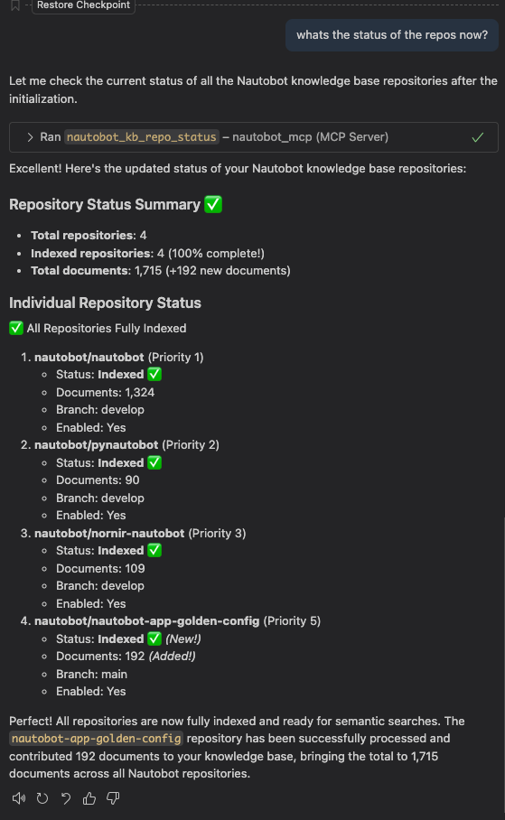

# Repository Management Steps

This guide walks through the repository management process with visual step-by-step instructions.

## Overview on how to add/list and check status of repositories currently used for Nautobot KB.

### List Repos

### Add Repo

### Check Status

### Re-Initialize Repos for Indexing

### Check Final Status

